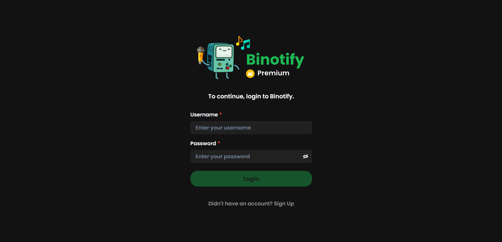
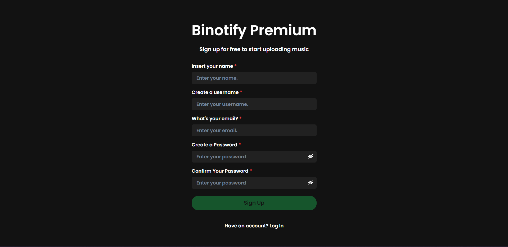
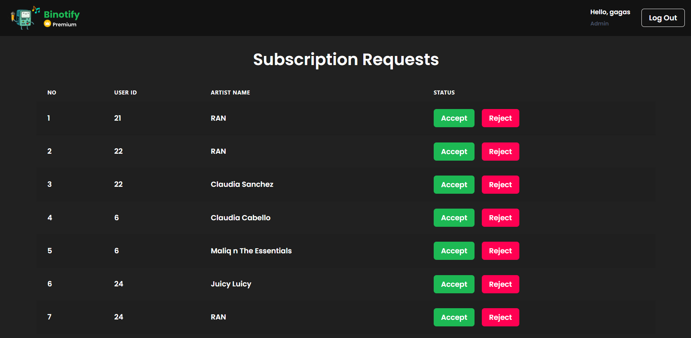
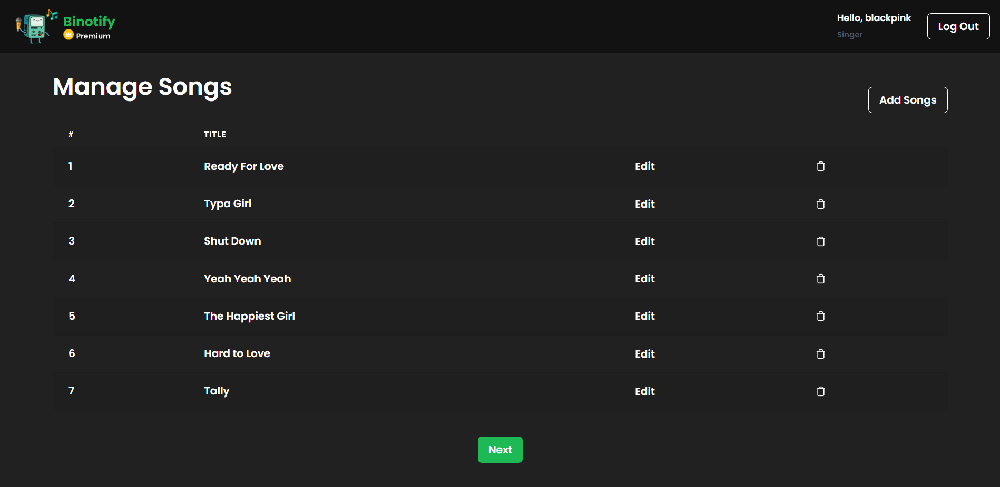
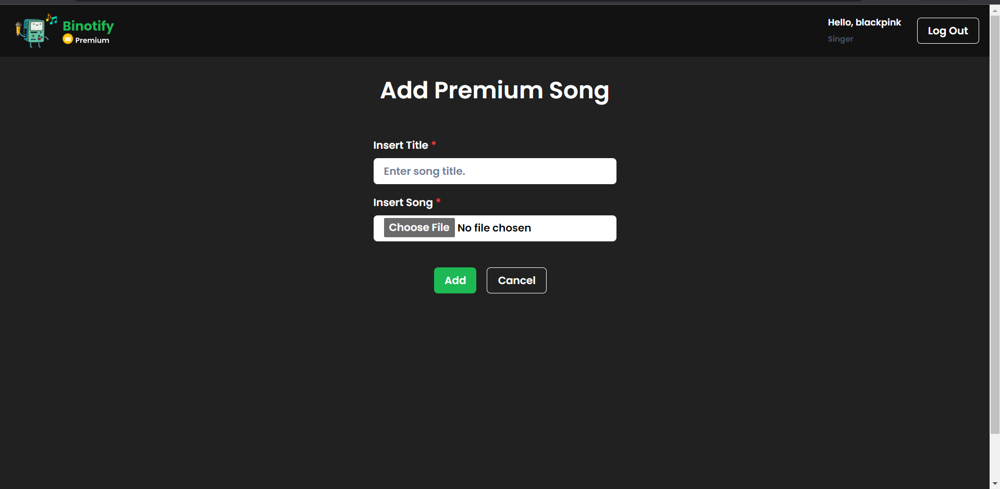
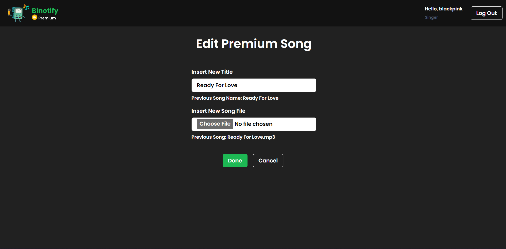
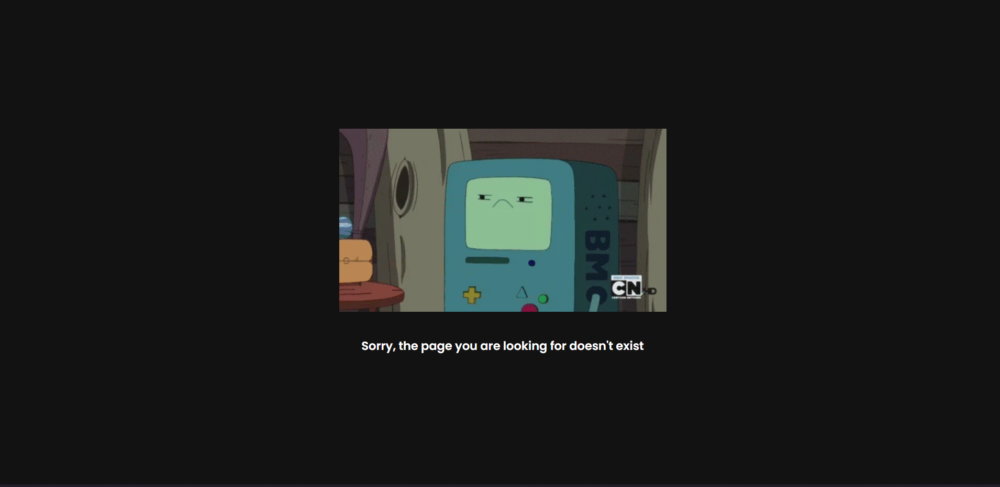

# binotify-premium-app: The Frontend for binotify

## Introduction

binotify-premium-app adalah frontend dari aplikasi Binotify Premium yang digunakan oleh admin untuk mengelola permintaan subscription dari user Binotify App dan pengelolaan lagu premium oleh artist. Aplikasi ini dibuat dengan menggunakan React + Typescript. Aplikasi ini dibuat untuk memenuhi tugas besar mata kuliah Pemrograman Aplikasi Berbasis Web.

## Overview Feature

- Chakra UI
- Loading state
- Toast
- Dockerized
- Responsive design
- HTTP Client with Axios
- Local Storage
- Vite

## Screenshot

### Login Page
  

### Register Page
  

### Subscription Management Page (Admin)
  

### Song Management Page (Artist)

#### List Lagu
  

#### Add Lagu
  

#### Edit Lagu
  

### 404
  

## Cara menjalankan aplikasi

Alternatif 1:

1. Pastikan sudah terinstall NodeJS
2. clone repositori ini
3. Buat file `.env` pada root folder aplikasi mengikuti contoh .env.example
4. Install dependency dengan menjalankan perintah `yarn install`
5. Jalankan aplikasi dalam mode development dengan `yarn dev`
6. Atau, dalam mode production, `yarn start`

### Pembagian Tugas

1. Login: 13520016, 13520073
2. Register: 13520016, 13520076
3. Subscription Management: 13520016, 13520076
4. Song Management: 13520016, 13520073, 13520076
5. Add Song: 13520076
6. Delete Song 13520076
7. Edit Song: 13520076
8. 404: 13520076
9. Navbar: 13520073, 13520076
10. Responsive Adjustments: 13520076
11. Initial Design: 13520073, 13520076
12. Project Setup: 13520016

#### Proudly Presented by Binosed, 2022
